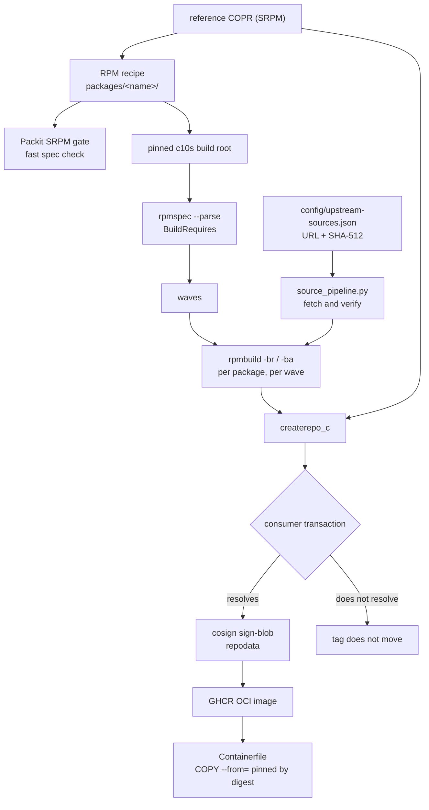

# Factory architecture

## The shape



Execution is entirely GitHub Actions on GitHub-hosted runners. There is no
Argo cluster, no self-hosted runner, no remote build service. Copr,
Packit-as-a-Service, Koji, Bodhi, Testing Farm and Kubernetes are not
dependencies of the binary path.

## Build root

`config/buildroot.json` pins `quay.io/centos-bootc/centos-bootc:c10s` by
digest. That is the image the released artifact is built on, so a package
built here links against the same libraries the running system has.

**The pin is pulled once per run** and passed to every job as an artifact,
under the bare local name `factory-buildroot:run`. That solves three things a
digest pin alone cannot:

- **Expiry mid-run.** `c10s` is republished frequently and superseded digests
  are garbage collected. A pin correct at 06:01 has been observed 404 by 07:13
  the same morning, killing every job in the affected waves on exit 125.
- **Provenance.** Every job provably used the same bytes, which is a stronger
  claim than a pin makes on its own.
- **Cost.** Several hundred registry pulls become one.

A job that failed to load the artifact cannot silently fall back to pulling
something else: `docker` refuses an unqualified name it does not have locally.

The bare name is deliberate. A fully-qualified name would let a job that lost
its artifact quietly resolve against a registry, and the run would produce
RPMs from a root nobody recorded.

## CRB

The c10s image ships with **CRB disabled**, and several build roots for this
stack live only there: `meson`, `ninja-build`, `wayland-devel`, `gcc-g++`.
Every build step enables it before resolving BuildRequires.

Without that, the failure is `No matching package to install: meson`, which
reads as a missing package rather than a disabled repository. The requirement
is declared in `config/buildroot.json` and asserted by `validate.py`, so it is
stated next to the pin it applies to instead of living in three workflow files.

## Naming the spec explicitly

Every `rpmbuild` invocation names the spec file:

```bash
rpmbuild -ba "$spec" --define "_topdir ..." --define "_sourcedir ..."
```

Invoked with no spec argument, `rpmbuild` globs the working directory. The build
output directory contains no spec, so the glob matches nothing and **`rpmbuild`
exits 0 having written nothing and printed nothing**. That is the worst failure
a build can have: green, silent, no RPMs.

The build stage guards it with an explicit `test -f "$spec"` and an artifact
check that fails when a package produced no RPM, but naming the file means the
case never arises.

## What Packit does here, and what it does not

**Does:** `packit srpm` against the pinned `quay.io/packit/packit` container.
A malformed spec fails in seconds instead of after a build root install and a
long compile. `%changelog` dates, unexpanded macros, broken `Patch:` lines —
all caught here.

**Does not:** build binaries. Packit Service would, through Copr, and Copr has
no CentOS Stream 10 chroot. `.packit.yaml` therefore has no `jobs:` section, so
Packit Service does nothing on a pull request. The only Packit configuration
that does anything is `create-archive`, which points at the factory's
already-verified Source0 rather than letting Packit download the spec's URL —
which would defeat the source lock entirely.

This is the same split `projectbluefin/utah-packages` operates under, for the
same underlying reason: the build root must be the one the image ships on, and
Copr cannot provide it.

## Build order

Solved, never declared:

```
extract_buildrequires.py   rpmspec --parse over every recipe, in the build root
build_graph.py             BuildRequires -> edges -> topological layers
```

A wave is one unit of parallelism. Everything in wave N builds concurrently;
everything in wave N+1 resolves its factory `BuildRequires` against wave N.

`rpmspec --parse` is used rather than a regex over the spec text because EL10
specs guard much of their `BuildRequires` behind `%if 0%{?rhel}`. A regex sees
both branches and would invent edges that do not apply, or miss ones that do.

Rich dependencies (`(a with b and c)`, alternations) are kept as whole strings
and every named candidate is recorded as a predecessor. Over-approximating can
only make a wave later than necessary. Under-approximating breaks the build.

A `BuildRequires` cycle among factory packages fails and **names its members**.
Dropping them silently is how a recipe stops being built.

The workflow's job graph is static, so the wave count is fixed at six and
`prepare` fails if the solved plan is deeper. That is a real decision, not an
overflow: the alternative is a plan that quietly omits packages.

## Incremental rebuilds

`prepare` reads the `org.projectbluefin.factory.state` label on the published
image, which records the input digest of every build it contains. A package is
selected when its digest differs from the recorded one, or when the label has
never seen it.

Not a git diff: once two runs queue, the second push's diff says nothing about
what the first run built.
Not a NEVR comparison: it misses a patch change that does not move the release.

Direct `BuildRequires` dependents of anything selected are dragged along. This
is correctness, not optimisation — a library whose soname moved must not leave
its consumers linked against the copy it replaced.

## Publication

Seeded from the previously published image, so the candidate is the last good
repository rather than only what this run built. Each source package built is
replaced **by source name**, so a dropped subpackage leaves with its parent.
A package that failed keeps its previous build.

A build failure alone does not block publication. That is the point of
incremental publication: if one package of seventy is flaky, the other
sixty-nine still reach consumers. Holding everything back is how three runs in
four weeks used to publish.

What does block is the **consumer transaction**: the packages the image
actually installs, resolved against the candidate plus the pinned `c10s` base.
If that does not resolve — a library moved its soname and a consumer was not
rebuilt — the tag does not move, however many packages built.

`repomd.xml` is signed keylessly with the workflow's OIDC identity via cosign,
and the image is provenance-attested.

## Source locking

`config/upstream-sources.json` records, for every source a recipe downloads, the
resolved URL and its SHA-512. `source_pipeline.py` fetches and verifies **before**
the build starts and again **inside** it, so a source swapped between the two
fails there rather than producing an RPM from bytes nobody checked.

**Every** Source is locked, not just Source0. Four recipes carry a second
downloadable source — glycin's vendored libjxl, malcontent's libgsystemservice,
docbook-style-xsl's docs — and a lock carrying only the first produces a recipe
that passes validation and then fails in `rpmbuild -bs` on a missing archive.

A URL fragment (`...tar.gz#/libjxl-0.11.1`) selects a subdirectory inside the
archive. rpm names the file after the URL *path* with the fragment stripped, so
the staged filename is derived that way; leaving `#` in the name stages a file
rpmbuild will not find.

A detached signature (`.sig`, `.asc`) is a legitimate source — the spec verifies
against it — so it is locked and verified like any other.

Re-rendering reuses digests for URLs that have not changed, so
`just factory-relock` fetches only what actually moved rather than every archive
in the factory.

### Sources the factory cannot have

Three recipes reference a source that is neither downloadable nor committed: a
`cargo vendor` tarball generated by hand (glycin, gnome-user-share), or a
bundled archive (malcontent's `gvdb.tar.xz` and `tinycdb-0.81.tar.gz`).

These are marked `blocked` in the lock with the reason, excluded from the build
list, and refused by the SRPM gate. Failing there rather than in `rpmbuild` is
the point: `rpmbuild -bs` reports `Bad file: ...vendor.tar.xz: No such file or
directory`, which names the archive and not the reason the factory cannot
produce it.

`validate.py --check generated` reports them and does **not** fail. A recipe
correctly identified as unbuildable is a correct state of the configuration; a
permanently red gate is a gate people stop reading.

Each of these is a real gap, not a rounding error:

- **Three recipes cannot be built at all.** glycin, gnome-user-share and
  malcontent need a hand-generated `cargo vendor` tarball or a bundled archive.
  They are excluded from builds with the reason recorded. Committing a
  generated vendor tarball would mean committing a binary blob whose contents
  depend on the crates.io index at generation time, which is not a provenance
  statement — so this needs a decision, not a workaround.
- **Builds are not hermetic.** The pinned container provides the right ABI but
  is not a build root in the sense `mock` means: no build user, no chroot
  isolation, no network isolation, no reset between packages. Two packages
  building concurrently in the same image could in principle interfere.
  `mock --hermetic-build` under `unshare --net` is the agreed direction and is
  not built. The blocker is that `mock-core-configs` does not ship an EL10
  chroot.
- **amd64 only.** The image publishes amd64 and arm64. Until arm64 recipes
  exist, the arm64 manifest cannot consume factory packages.
- **No build cache.** Each run recompiles what it selects. A cache keyed on
  the input digest plus the resolved build root would pay for itself quickly;
  it is not implemented.
- **Release gating is advisory.** `report` names every package that did not
  build, but nothing merges that into a required status check. The SRPM gate is
  the only merge-blocking factory check, and it is not required in the
  ruleset.
